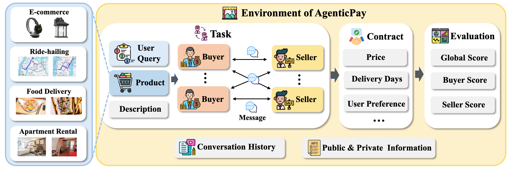
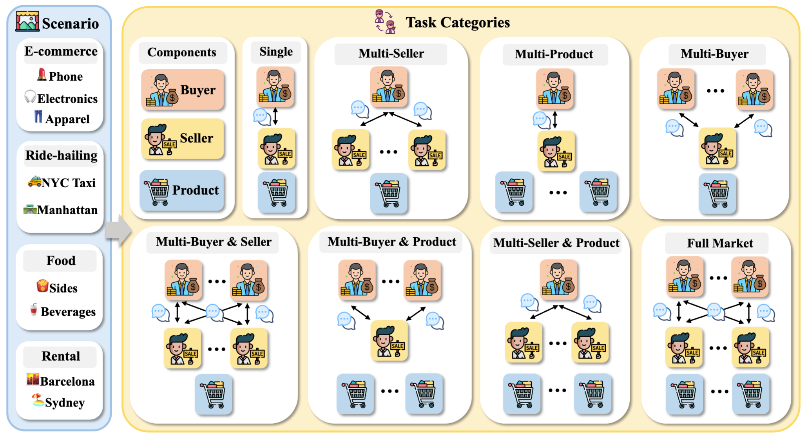

<div align="center">
  <a href="https://github.com/SafeRL-Lab/AgenticPay">
     
  </a>

 
  
<h1 align="center" style="font-size: 30px;"><strong><em>AgenticPay</em></strong>: A Multimodal Benchmark for LLM-Powered Negotiation in Multi-Agent Commerce</h1>
<p align="center">
    <a href="https://arxiv.org/pdf/2602.06008">Paper</a>
    ·
    <a href="https://github.com/SafeRL-Lab/AgenticPay">Code</a>
    ·
    <a href="https://agenticpay-tutorial.readthedocs.io/en/latest/">Tutorial</a>
    ·
    <a href="https://github.com/SafeRL-Lab/AgenticPay/issues">Issue</a>
  </p>
</div>


---



<h3 align="center" style="font-size: 30px;">Figure 1: AgenticPay Framework Overview</h3>


<h3 align="center" style="font-size: 30px;">Figure 2: Scenario and Task Categories</h3>

---

- [Overview](#overview)
- [Features](#features)
- [Installation](#installation)
- [Quick Start](#quick-start)
  * [Before Running Examples](#before-running-examples)
  * [Running the Example Script](#running-the-example-script)
  * [Basic Single-Product Negotiation](#basic-single-product-negotiation)
- [Project Structure](#project-structure)
- [Core Components](#core-components)
  * [Environments](#environments)
  * [Agents](#agents)
  * [Environment Registration System](#environment-registration-system)
  * [ConversationMemory](#conversationmemory)
  * [Metrics](#metrics)
- [Configuration](#configuration)
  * [Environment Parameters](#environment-parameters)
  * [Agent Configuration](#agent-configuration)
  * [User Profile](#user-profile)
  * [Contract Configuration](#contract-configuration)
  * [LLM Configuration](#llm-configuration)
- [Examples](#examples)
  * [Available Examples](#available-examples)
  * [Registering New Environments](#registering-new-environments)
  * [Adding New Features](#adding-new-features)
- [License](#license)
- [Contributing](#contributing)
- [Citation](#citation)

---


## Overview

AgenticPay is a framework and benchmark for evaluating LLM/VLM agents in realistic buyer–seller commerce. It extends negotiation beyond text-only, bilateral price haggling into multimodal, multi-dimensional contract negotiation across 4 real-world scenarios (E-commerce, Food Delivery, Ride-hailing, and Apartment Rental) and 8 market topologies, from 1-to-1 bargaining to many-to-many markets. The codebase keeps a Gymnasium-like API for easy integration, reproducible examples, and extensible environment registration.

## Features

- 🤖 **LLM/VLM-based Agents**: Buyer and Seller agents powered by text and vision-language models (OpenAI-compatible APIs, vLLM, SGLang, Qwen3-VL)
- 🖼️ **Multimodal Product Grounding**: Tasks can include product images, visual route context, listings, menus, and rich text attributes
- 📄 **Multi-dimensional Contracts**: Agents negotiate complete JSON contracts with price, continuous terms, and discrete terms instead of a single scalar price
- 💬 **Multi-turn Conversations**: Support for extended natural-language negotiation dialogues with structured contract proposals
- 🧠 **Memory and Mental Models**: Conversation history plus prompt-level opponent modeling for information-asymmetric bargaining
- 📊 **Utility-based Metrics**: GlobalScore, BuyerScore, and SellerScore evaluate feasibility, welfare, surplus split, and efficiency
- 🏪 **Environment Registration System**: Gymnasium-like environment registration for easy environment management
- 🛍️ **160 Benchmark Tasks**: 4 scenarios × 8 market topologies × 5 tasks, with additional legacy/demo scripts
- 👥 **Multi-Agent Scenarios**: Multiple buyers, sellers, and products in parallel or sequential negotiation modes
- 👤 **User Profiles**: Personal preference system that influences product matching and negotiation behavior

## Installation

```bash
# Create conda environment
conda create -n agenticpay python=3.10 -y
conda activate agenticpay

# Navigate to project directory
cd AgenticPay

# Install dependencies
pip install -r requirements.txt

# Install package in editable mode
pip install -e .
```

**Model Download**: Download models from Hugging Face and save them to the `agenticpay/models/download_models` directory for local model usage.

## Quick Start

### Before Running Examples

1. **Configure the project**: Copy `agenticpay/examples/config_example.py` to `agenticpay/examples/config.py` and set API keys, local model paths, and common environment parameters.
2. **Choose a model backend**: The current examples use OpenAI-compatible text/VLM APIs, local VLM backends, and legacy local LLM backends depending on the task:
   - `OpenAIVLM` / `OpenAILLM` — cloud or OpenAI-compatible APIs
   - `Qwen3VL`, `SGLangVLM`, `VLLMLLM` — local multimodal/text inference
3. **Legacy Task1 model invocation examples**: For the basic price negotiation task, the repo still provides three example files demonstrating different ways to call LLMs:
   - `Task1_basic_price_negotiation_api_example.py` — OpenAI/compatible API
   - `Task1_basic_price_negotiation_sglang_example.py` — SGLang for local inference
   - `Task1_basic_price_negotiation_vllm_example.py` — vLLM for local inference (multi-GPU)

### Running the Example Script

To quickly try a current multimodal, multi-dimensional contract negotiation task, run one of the scenario scripts:

```bash
python agenticpay/examples/single_buyer_product_seller/Task4_s1_beauty_product_negotiation.py
```

This script runs a single-buyer/single-seller E-commerce task grounded in a product image and a contract schema with price, delivery time, return policy, packaging, and user preference match.

To run all example groups, use:

```bash
bash agenticpay/examples/run_all_examples.sh
```

You can still run the original text-only price negotiation demo with:

```bash
python agenticpay/examples/single_buyer_product_seller/Task1_basic_price_negotiation.py
```

### Basic Single-Product Negotiation

The low-level environment loop remains the same for legacy price-only tasks and current contract-mode tasks. For full multimodal `contract_config` examples, see the scenario scripts under `agenticpay/examples/*/Task*_s*.py`.

```python
from agenticpay import make  # Recommended: use registration system
from agenticpay.agents.buyer_agent import BuyerAgent
from agenticpay.agents.seller_agent import SellerAgent
import os


# Local models (SGLang, vLLM, etc.)
from agenticpay.models.sglang_vlm import SGLangVLM
from agenticpay.models.vllm_lm import VLLMLLM

model_path = "agenticpay/models/download_models/Qwen3-VL-8B-Instruct"

# Option 1: SGLang VLM
model = SGLangVLM(model_path=model_path)

# Option 2: vLLM LM (for multi-GPU setups)
# model = VLLMLLM(
#     model_path=model_path,
#     trust_remote_code=True,
#     gpu_memory_utilization=0.9,
#     tensor_parallel_size=4,  # Number of GPUs
# )

# Create agents with bottom prices (confidential)
buyer_max_price = 120.0  # Maximum acceptable price for buyer
seller_min_price = 80.0   # Minimum acceptable price for seller

buyer = BuyerAgent(model=model, buyer_max_price=buyer_max_price)
seller = SellerAgent(model=model, seller_min_price=seller_min_price)

# Configure reward weights (optional)
reward_weights = {
    "buyer_savings": 1.0,      # Buyer savings weight
    "seller_profit": 1.0,      # Seller profit weight
    "time_cost": 0.1,          # Time cost weight
}

# Create environment using registration system (recommended)
env = make(
    "Task1_basic_price_negotiation-v0",
    buyer_agent=buyer,
    seller_agent=seller,
    max_rounds=20,
    initial_seller_price=150.0,
    buyer_max_price=buyer_max_price,
    seller_min_price=seller_min_price,
    environment_info={
        "temperature": "warm",
        "season": "summer",
        "weather": "sunny",
    },
    price_tolerance=0.0,
    reward_weights=reward_weights,  # Optional: reward weights configuration
)

# User profile (optional text description of personal preferences)
user_profile = "User prefers business/professional style and likes to compare prices before making purchases. In negotiations, they may mention comparing other options and seek better deals."

# Reset and start negotiation
observation, info = env.reset(
    user_requirement="I need a high-quality winter jacket",
    product_info={
        "name": "Premium Winter Jacket",
        "brand": "Mountain Gear",
        "price": 180.0,
        "features": ["Waterproof", "Insulated", "Windproof", "Breathable"],
        "condition": "New",
        "material": "Gore-Tex",
    },
    user_profile=user_profile,  # Optional
)

# Run negotiation loop
done = False
while not done:
    # Buyer responds first
    buyer_action = buyer.respond(
        conversation_history=observation["conversation_history"],
        current_state=observation
    )
    
    # Update conversation history with buyer's response
    updated_conversation_history = observation["conversation_history"].copy()
    if buyer_action:
        current_round = observation.get("current_round", 0)
        updated_conversation_history.append({
            "role": "buyer",
            "content": buyer_action,
            "round": current_round
        })
    
    # Seller responds (can see buyer's message)
    seller_action = seller.respond(
        conversation_history=updated_conversation_history,
        current_state=observation
    )
    
    # Execute step with both actions
    observation, reward, terminated, truncated, info = env.step(
        buyer_action=buyer_action,
        seller_action=seller_action
    )
    done = terminated or truncated
    env.render()

print(f"Negotiation ended: {info['status']}")
print(f"Final price: ${info.get('seller_price', 'N/A')}")
env.close()
```

## Project Structure

```
AgenticPay/
├── agenticpay/
│   ├── agents/                    # Agent implementations (buyer, seller)
│   ├── envs/                      # Environment implementations
│   │   ├── single_buyer_product_seller/  # Basic negotiation
│   │   ├── only_multi_products/   # Multi-product scenarios
│   │   ├── only_multi_seller/     # Multi-seller scenarios
│   │   ├── only_multi_buyer/      # Multi-buyer scenarios
│   │   └── multi_*/               # Complex multi-agent scenarios
│   ├── models/                    # LLM/VLM implementations (OpenAI API, vLLM, SGLang, Qwen3-VL)
│   ├── memory/                    # Conversation history management
│   ├── results/                   # Evaluation outputs and paper-related materials
│   ├── utils/                     # Utilities (state, user profile)
│   └── examples/                  # Example scripts organized by market topology
├── rm_img/                        # README figures
├── README.md
├── setup.py
└── requirements.txt
```

## Core Components

### Environments

The framework provides negotiation environments organized by market topology. The latest benchmark instantiates 160 multimodal tasks: 4 real-world scenarios × 8 market topologies × 5 tasks per cell. Several legacy price-only demos remain for backward compatibility.

Every category below ships with a set of structural/base tasks (the legacy price-only or "shape" demos that vary the number of buyers, sellers, products, and parallel/sequential mode), plus a shared bank of **25 multimodal, multi-dimensional scenario tasks** (`s1`–`s25`) that each category instantiates against its own market shape:

- **`s1`–`s10`** — Consumer / e-commerce products (beauty, toothpaste, riflescope, headphones, wall lantern, bookshelf, sandals/flip-flops, jeans/T-shirt/men's shirt, beverages/air plants, food coloring/smokehouse treats)
- **`s11`–`s15`** — Taxi / ride-hailing (`taxi_1` … `taxi_5`)
- **`s16`–`s20`** — Food delivery (`food_delivery_1` … `food_delivery_5`)
- **`s21`–`s25`** — Apartment rental (`rent_house_1` … `rent_house_5`)

Concrete file names vary slightly per category (e.g. bundle vs. single product, package vs. parallel), but the scenario index `sN` is consistent across categories so the same underlying scenario can be compared across market structures.

#### Single Buyer + Product + Seller (`single_buyer_product_seller/`)

Basic negotiation scenarios with one buyer, one product, and one seller.

- **Task1–Task3** — Legacy price-only negotiation demos (basic / close-price / close-to-market-price). `Task1` additionally provides API, vLLM, and SGLang variants for different inference backends.
- **Task4–Task28** — The full `s1`–`s25` scenario suite (consumer products, taxi, food delivery, rent house) instantiated as single-buyer / single-product / single-seller multidimensional negotiations.

#### Only Multi-Products (`only_multi_products/`)

Environments for negotiating multiple products or bundled products with a single buyer and seller.

- **Task1: Multi-Product Negotiation** — General multi-product negotiation
- **Task2: Two Product Negotiation** — Two products negotiation
- **Task3: Five Product Negotiation** — Five products negotiation
- **Task4: Select Three from Five Negotiation** — Product selection and negotiation
- **Task5–Task29** — `s1`–`s25` scenarios reformulated as multi-product / bundled-product deals (e.g. beauty bundles, headphones+speaker, bed+wall-lantern, taxi multi-leg, food-delivery combos, rent-house packages).

#### Only Multi-Seller (`only_multi_seller/`)

Environments with multiple sellers competing for a single buyer, in both parallel and sequential modes.

- **Task1–Task2: Parallel Multi-Seller** — Parallel negotiations with two/three sellers
- **Task3–Task4: Sequential Multi-Seller** — Sequential negotiations with two/three sellers
- **Task5–Task29** — `s1`–`s25` scenarios with multiple competing sellers (consumer products, taxi services, food-delivery providers, rental landlords).

#### Only Multi-Buyer (`only_multi_buyer/`)

Environments with multiple buyers competing for products, in both parallel and sequential modes.

- **Task1–Task2: Parallel Multi-Buyer** — Parallel negotiations with two/three buyers
- **Task3–Task4: Sequential Multi-Buyer** — Sequential negotiations with two/three buyers
- **Task5–Task28** — `s1`–`s25` scenarios with multiple competing buyers across consumer products, taxi, food delivery, and rent-house markets.

#### Multi-Buyer Multi-Seller (`multi_buyer_multi_seller/`)

Complex environments with multiple buyers and multiple sellers.

- **Task1–Task2: Parallel** — 2-buyer-2-seller and 3-buyer-3-seller parallel negotiations
- **Task3–Task4: Sequential** — 2-buyer-2-seller and 3-buyer-3-seller sequential negotiations
- **Task5–Task29** — `s1`–`s25` scenarios under a multi-buyer / multi-seller market.

#### Multi-Products Multi-Seller (`multi_products_multi_seller/`)

Environments with multiple products and multiple sellers.

- **Task1–Task2: Parallel** — Parallel negotiations with two/three sellers, one product each
- **Task3–Task4: Sequential** — Sequential negotiations with two/three sellers, one product each
- **Task5–Task29** — `s1`–`s25` scenarios cast as multi-product / multi-seller markets.

#### Multi-Buyer Multi-Products (`multi_buyer_multi_products/`)

Environments with multiple buyers and multiple products.

- **Task1–Task2: Parallel** — Parallel negotiations with multiple buyers over multiple products
- **Task3–Task4: Sequential** — Sequential negotiations with multiple buyers over multiple products
- **Task5–Task29** — `s1`–`s25` scenarios as multi-buyer / multi-product (often bundle/package) deals.

#### Multi-Buyer Multi-Products Multi-Seller (`multi_buyer_multi_products_multi_seller/`)

Full-market environments with multiple buyers, products, and sellers.

- **Task1–Task2: Parallel** — Parallel multi-buyer / multi-seller / multi-product negotiations
- **Task3–Task4: Sequential** — Sequential multi-buyer / multi-seller / multi-product negotiations
- **Task5–Task29** — `s1`–`s25` scenarios under a full multi-buyer × multi-product × multi-seller market.

**Common Environment Methods:**
- `reset()`: Initialize a new negotiation
- `step()`: Execute one negotiation turn (accepts agent actions and parses contract proposals)
- `render()`: Display current negotiation state
- `close()`: Close environment and clean up

### Agents

#### BaseAgent

Abstract base class for all agents.

**Subclasses:**
- `BuyerAgent`: Represents the buyer, negotiates based on user requirements and budget
- `SellerAgent`: Represents the seller, negotiates based on product information and market conditions

### Environment Registration System

Gymnasium-like environment registration system for easy environment management.

**Key Functions:**
- `make()`: Create environment instance by ID
- `register()`: Register new environment
- `spec()`: Get environment specification
- `pprint_registry()`: List all registered environments

**Usage:**
```python
from agenticpay import make

# Single buyer/product/seller
env = make("Task1_basic_price_negotiation-v0", buyer_agent=buyer, seller_agent=seller, max_rounds=20)

# Multi-product
env = make("Task1_multi_product_negotiation-v0", buyer_agent=buyer, seller_agent=seller, max_rounds_per_product=20)

# Multi-seller
env = make("Task1_parallel_two_seller_negotiation-v0", buyer_agent=buyer, seller_agents=[seller1, seller2], max_rounds=20)
```

### ConversationMemory

Manages conversation history and context.

**Features:**
- Message storage with metadata
- History retrieval (full or recent)
- Role-based filtering

### Metrics

AgenticPay reports utility-based scores for contract-mode tasks:
- `GlobalScore`: Overall welfare, agreement quality, and negotiation efficiency
- `BuyerScore`: Buyer-side normalized utility and efficiency
- `SellerScore`: Seller-side normalized utility and efficiency

## Configuration

### Environment Parameters

Common parameters across environments:
- `max_rounds`: Maximum number of negotiation rounds
- `initial_seller_price`: Starting price from seller
- `buyer_max_price`: Maximum acceptable price for buyer (confidential)
- `seller_min_price`: Minimum acceptable price for seller (confidential)
- `price_tolerance`: Price difference threshold for agreement
- `environment_info`: Contextual information (weather, season, etc.)
- `contract_config`: Multi-dimensional contract schema and private utility weights for contract-mode tasks
- `reward_weights`: Dictionary controlling the relative importance of different reward components
  - `buyer_savings`: Weight for buyer savings (difference between max price and agreed price)
  - `seller_profit`: Weight for seller profit (difference between agreed price and min price)
  - `time_cost`: Weight for time cost (penalty for negotiation rounds)

### Agent Configuration

- **BuyerAgent**: `buyer_max_price` (maximum acceptable purchase price)
- **SellerAgent**: `seller_min_price` (minimum acceptable selling price)

### User Profile

User descriptions are passed as strings during negotiation initialization and can affect product preference matching, style, and bargaining behavior.

### Contract Configuration

Current benchmark tasks use `contract_config` to define:
- `field_descriptions`: Meaning of `price`, `continuous_terms`, and `discrete_terms`
- `continuous_bounds`: Numeric ranges such as delivery days, wait time, or lease months
- `discrete_options`: Enumerated terms such as return policy, packaging, utilities, or preference match
- `buyer_preferences` / `seller_preferences`: Private base values and utility weights used for scoring

### LLM Configuration

Supports multiple providers:
- **Vision-Language Models**: `OpenAIVLM`, `Qwen3VL`, `SGLangVLM` - for image-grounded negotiation tasks
- **Local Text Models**: `VLLMLLM` - for local text model inference (supports multi-GPU setups)
- **OpenAI** (API): `OpenAILLM` - requires API key
- **Custom/OpenAI-compatible APIs**: `CustomLLM` - for compatible hosted endpoints

## Examples

### Available Examples

Examples are organized by market topology. Each topology directory contains `Task*.py` scenario scripts plus a `run_all_tasks.sh` helper; the root `run_all_examples.sh` runs all available groups.

1. **Single Buyer + Product + Seller** (`examples/single_buyer_product_seller/`)
   - `Task1_basic_price_negotiation_api_example.py` - Basic price negotiation via API (OpenAI/compatible)
   - `Task1_basic_price_negotiation_sglang_example.py` - Basic price negotiation via SGLang
   - `Task1_basic_price_negotiation_vllm_example.py` - Basic price negotiation via vLLM
   - `Task2_close_price_negotiation.py` - Close price negotiation
   - `Task3_close_to_market_price_negotiation.py` - Market price negotiation
   - `Task4_s1_beauty_product_negotiation.py` and later scenario scripts - multimodal contract-mode benchmark tasks

2. **Multi-Product Negotiations** (`examples/only_multi_products/`)
   - Multiple-product and bundle negotiation examples
   - Product selection and contract trade-off scenarios

3. **Multi-Seller Negotiations** (`examples/only_multi_seller/`)
   - Parallel and sequential multi-seller scenarios

4. **Multi-Buyer Negotiations** (`examples/only_multi_buyer/`)
   - Parallel and sequential multi-buyer scenarios

5. **Complex Multi-Agent Scenarios**
   - `examples/multi_buyer_multi_seller/` - Multiple buyers and sellers
   - `examples/multi_products_multi_seller/` - Multiple products and sellers
   - `examples/multi_buyer_multi_products/` - Multiple buyers and products
   - `examples/multi_buyer_multi_products_multi_seller/` - Full multi-agent scenarios

The benchmark covers four scenario families: E-commerce, Ride-hailing, Food Delivery, and Apartment Rental. Current task scripts use names such as `Task*_s*_taxi_*.py`, `Task*_s*_food_delivery_*.py`, and `Task*_s*_rent_house_*.py` to indicate scenario instances.

### Registering New Environments

1. Create a new environment class inheriting from `BaseEnv`
2. Implement `reset()` and `step()` methods
3. Register using the registration system

Example:
```python
from agenticpay.core import BaseEnv
from agenticpay.envs import register

class MyCustomEnv(BaseEnv):
    def reset(self, **kwargs):
        # Implementation
        return observation, info
    
    def step(self, action):
        # Implementation
        return observation, reward, terminated, truncated, info

# Register environment
register(
    id="MyCustomEnv-v0",
    entry_point="agenticpay.envs.my_custom_env:MyCustomEnv",
    max_episode_steps=100,
)
```

### Adding New Features

The framework is designed to be extensible. Key extension points:
- Custom reward functions
- Custom contract schemas and utility weights
- Advanced price extraction
- Custom negotiation strategies
- Learning-based agent behaviors
- Additional agent types
- Additional VLM/LLM providers
- Custom memory systems

For detailed guides, see:
- `ENV_REGISTRATION.md` - Environment registration system
- `PROJECT_STRUCTURE.md` - Project structure and extension points
- `QUICKSTART.md` - Quick start guide

## License

MIT License

## Contributing

Contributions are welcome! Please feel free to submit issues or pull requests.

## Citation

If you use AgenticPay in your research, please cite:

```bibtex
@article{liu2026agenticpay,
  title={AgenticPay: A Multi-Agent LLM Negotiation System for Buyer-Seller Transactions},
  author={Liu, Xianyang and Gu, Shangding and Song, Dawn},
  journal={arXiv preprint arXiv:2602.06008},
  year={2026}
}
```
